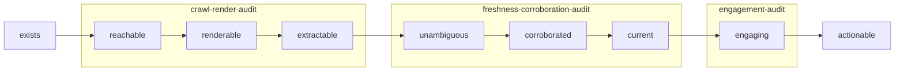
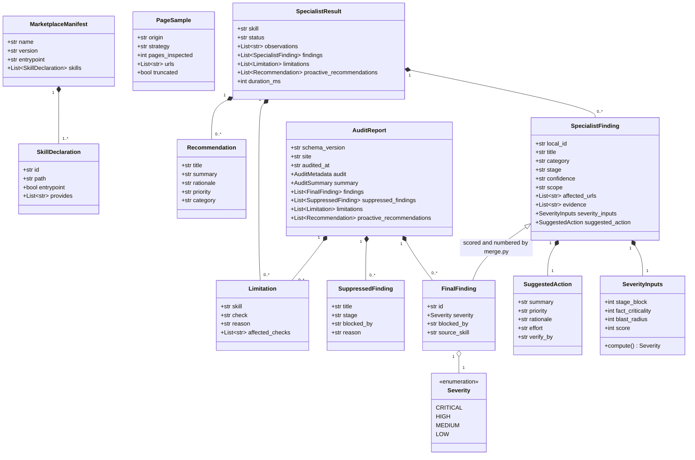
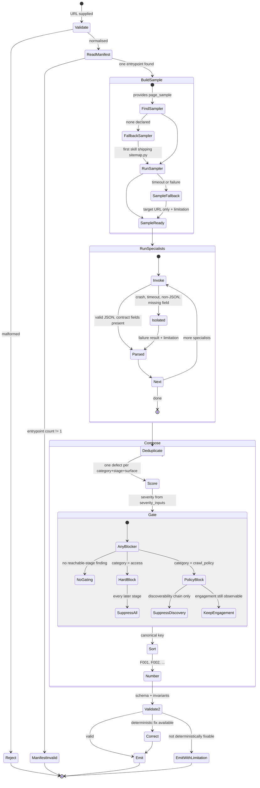
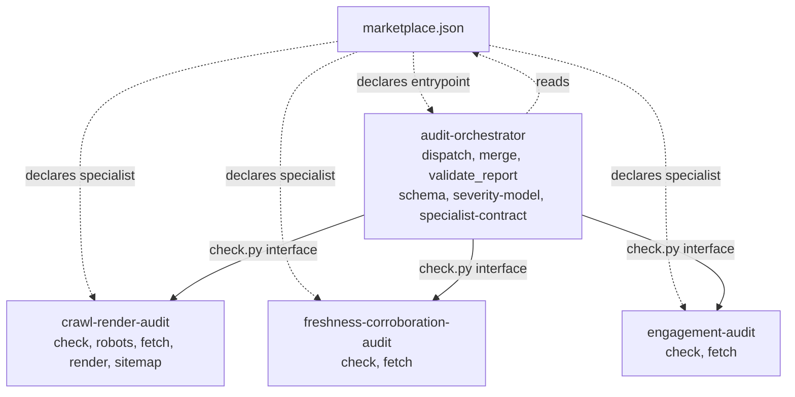

# Brand AI Readiness Audit — UML Diagrams

Architecture of the **Brand AI Readiness Audit** marketplace (Adobe University
Hackathon 2026, Round 3).

A read-only agent skill marketplace that audits a public website for AI
discoverability and on-site engagement, and emits one deterministic,
evidence-backed report.

Four skills, one entrypoint, each owning a contiguous band of the discovery
funnel.

---

## 0. The model everything follows



A defect belongs to the **earliest** stage it breaks. A finding downstream of an
upstream blocker is gated, not reported twice.

---

## 1. Component Diagram

```mermaid
flowchart TB
    subgraph ROOT["Marketplace Root"]
        MANIFEST["marketplace.json"]

        subgraph ORCH["audit-orchestrator (entrypoint)"]
            OSPEC["SKILL.md"]
            DISPATCH["scripts/dispatch.py"]
            MERGE["scripts/merge.py"]
            VALIDATE["scripts/validate_report.py"]
            SCHEMA["references/schema.json"]
            SEV["references/severity-model.md"]
            CONTRACT["references/specialist-contract.md"]
        end

        subgraph CRA["crawl-render-audit"]
            CCHECK["scripts/check.py"]
            ROBOTS["scripts/robots.py"]
            FETCH1["scripts/fetch.py"]
            RENDER["scripts/render.py (optional)"]
            SITEMAP["scripts/sitemap.py"]
        end

        subgraph FCA["freshness-corroboration-audit"]
            FCHECK["scripts/check.py"]
            FETCH2["scripts/fetch.py"]
        end

        subgraph EA["engagement-audit"]
            ECHECK["scripts/check.py"]
            FETCH3["scripts/fetch.py"]
        end
    end

    subgraph TARGET["Target System"]
        SITE["Public website"]
        RTXT["robots.txt"]
        SMAP["Sitemap XML"]
        SAMEAS["Declared sameAs profiles"]
    end

    OSPEC --> DISPATCH
    DISPATCH -->|reads skills + entrypoint| MANIFEST
    DISPATCH -->|--emit-sample| SITEMAP
    SITEMAP -->|sample.json| DISPATCH
    DISPATCH -->|check.py url --sample-file| CCHECK
    DISPATCH -->|check.py url --sample-file| FCHECK
    DISPATCH -->|check.py url --sample-file| ECHECK

    CCHECK --> ROBOTS
    CCHECK --> FETCH1
    CCHECK --> RENDER
    FCHECK --> FETCH2
    ECHECK --> FETCH3

    ROBOTS --> RTXT
    SITEMAP --> SMAP
    FETCH1 --> SITE
    FETCH2 --> SITE
    FETCH2 -.->|max 3, existence only| SAMEAS
    FETCH3 --> SITE
    RENDER -.->|only if a browser exists| SITE

    CCHECK -->|specialist JSON| DISPATCH
    FCHECK -->|specialist JSON| DISPATCH
    ECHECK -->|specialist JSON| DISPATCH

    DISPATCH -->|aggregate JSON| MERGE
    MERGE -.->|applies| SEV
    MERGE --> VALIDATE
    VALIDATE -.->|checks against| SCHEMA
    VALIDATE --> REPORT["Final audit report (JSON)"]

    CONTRACT -.->|governs| CCHECK
    CONTRACT -.->|governs| FCHECK
    CONTRACT -.->|governs| ECHECK
```



---

## 2. Class Diagram



Note the direction: a specialist produces `SeverityInputs`, never a `Severity`.
The enum is only ever populated by `merge.py`.

---

## 3. Sequence Diagram

```mermaid
sequenceDiagram
    autonumber
    actor Agent as Agent / User
    participant O as audit-orchestrator
    participant D as dispatch.py
    participant M as marketplace.json
    participant SM as sitemap.py (sampler)
    participant S as specialist check.py
    participant MG as merge.py
    participant V as validate_report.py

    Agent->>O: audit request (URL)
    O->>O: validate and normalise URL
    O->>D: dispatch.py <url>

    D->>M: read manifest
    M-->>D: skills, entrypoint flag, provides
    D->>D: exactly one entrypoint? else fail closed

    D->>SM: sitemap.py <url> --emit-sample
    SM->>SM: robots sitemaps, then /sitemap.xml, bounded
    SM-->>D: shared sample (8-12 URLs, round-robin by path role)
    D->>D: write sample.json to work dir

    loop each specialist, in manifest order
        D->>S: check.py <url> --sample-file sample.json
        S->>S: robots, retrieve, analyse sampled pages
        alt well-formed JSON on stdout
            S-->>D: observations, findings, limitations, recommendations
        else crash / timeout / non-JSON / missing field
            D->>D: synthesise failure result + limitation
        end
    end

    D-->>MG: aggregate (results, sample, limitations, recommendations)

    MG->>MG: 1. deduplicate by category + stage + surface
    MG->>MG: 2. gate (hard block gates all; policy block gates discoverability only)
    MG->>MG: 3. score = stage_block x fact_criticality x blast_radius
    MG->>MG: 4. canonical sort, then number F001..
    MG-->>V: candidate report

    V->>V: schema conformance (jsonschema if present, else built-in)
    V->>V: invariants: ID contiguity, counts, ordering, severity match, references
    alt valid
        V-->>O: validated report
        O-->>Agent: one JSON object
    else invalid
        V-->>O: error list
        O->>O: deterministic correction, else record as limitation
        O-->>Agent: report with limitations
    end
```

---

## 4. Activity Diagram



---

## 5. Package Diagram



Dependency direction runs one way only. No specialist imports the orchestrator,
and no specialist imports another specialist. `fetch.py` is duplicated rather
than shared so each skill folder stays independently valid.

---

## 6. Architectural highlights

| Pattern | Implementation | Why it matters |
|---|---|---|
| **Funnel-banded decomposition** | each skill owns contiguous stages of `reachable -> actionable` | the split is a separation of concerns, not padding, and it gives fix order for free |
| **Marketplace / plugin** | `marketplace.json` declares skills, entrypoint and `provides` | adding a specialist needs no orchestrator change |
| **Shared page sample** | `sitemap.py --emit-sample`, passed to every specialist | findings are comparable across skills and reproducible between runs; `blast_radius` follows a real ratio |
| **Observe / score split** | specialists emit `severity_inputs`; only `merge.py` writes `severity` | severity is a property of the marketplace, not of whichever skill noticed |
| **Two-tier blocker reach** | hard access failures gate everything; policy blocks gate discoverability only | one root cause is not reported four times, and the engagement half is never silently dropped |
| **Fault isolation** | crash, timeout, non-JSON and contract breaches all become `limitations` | one broken specialist cannot end the audit or fake a clean result |
| **Capability honesty** | `render.py` reports `available: false`; missing capabilities downgrade `confidence` | absence of a tool never manufactures a finding |
| **Contract-driven validation** | `validate_report.py` enforces schema **and** internal invariants | a schema-valid but self-contradictory report is worse than none |
| **Determinism** | fixed sort key, no timestamps or randomness in identifiers | identical inputs produce a byte-identical report |
